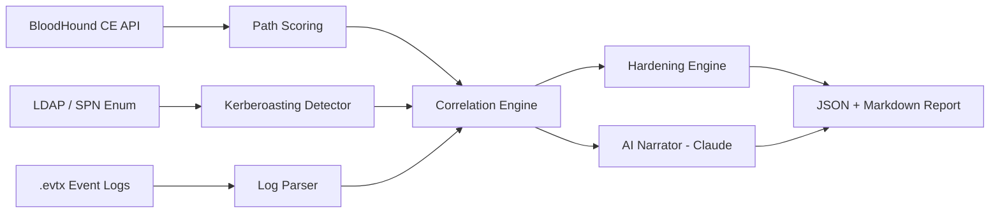

# AD Attack Path & Detection Platform

Ingests BloodHound attack-path data, correlates it with Windows event logs
to detect active exploitation, flags Kerberoastable accounts, and generates
plain-English executive briefs + hardening recommendations via Claude.


ad-attack-path-platform/
├── requirements.txt
├── config.yaml                    # domain, BloodHound API creds, Claude API key, log paths
├── README.md
│
├── bloodhound_client/
│   ├── __init__.py
│   ├── api.py                     # auth + query wrapper for BloodHound API
│   ├── queries.py                 # Cypher queries: top attack paths, shortest path to DA, etc.
│   └── models.py                  # data classes for paths/nodes/edges
│
├── kerberoast_detector/
│   ├── __init__.py
│   ├── spn_enum.py                # LDAP SPN enumeration (via impacket ldap3)
│   └── weak_crypto.py             # flags msDS-SupportedEncryptionTypes = RC4/DES
│
├── log_correlation/
│   ├── __init__.py
│   ├── parser.py                  # parses 4624/4625/4768/4769 (+ 4662 for DCSync)
│   ├── evtx_reader.py             # local .evtx file support (offline/lab mode)
│
├── narrator/
│   ├── __init__.py
│   ├── claude_client.py           # Anthropic API wrapper
│   └── prompts.py                 # prompt templates for exec-brief generation
│
├── hardening_engine/
│   ├── __init__.py
│   ├── rules.py                   # attack-pattern -> recommendation mapping
│   └── mappings.yaml              # e.g. GenericAll on GPO -> tiering/ACL fix
│
├── reports/
│   └── (generated output: JSON + Markdown/PDF briefs)
│
├── tests/
│
└── main.py                        # CLI entrypoint / orchestrator

## Setup

```bash
python -m venv venv
source venv/bin/activate         # or venv\Scripts\activate on Windows
pip install -r requirements.txt

cp config.yaml.example config.yaml
# edit config.yaml with your BloodHound CE credentials
```

BloodHound CE API credentials: generate under **Settings > API Keys** in
the BloodHound CE UI. Requires BloodHound CE (not legacy BloodHound —
legacy has no REST API and isn't supported by this client yet).

## Generating a BloodHound CE API Key

1. Log into the BloodHound CE UI:http://localhost:8080/ui/login # username is admin 
2. Click the gear/cog icon (top right) → **Administration**
3. Go to **Manage Users**
4. Find your `admin` user (or a dedicated service account, if you've created one)
   in the list, and click the hamburger menu (☰) next to it
5. Select **Generate / Revoke API Tokens**
6. Click **Create Token**
7. Give it a descriptive name (e.g. `attack-path-platform`) and click **Save**
8. Copy both values immediately — the **Token Key** is only shown once:
   - **Token ID** → goes in `config.yaml` as `bloodhound.api_id`
   - **Token Key** → goes in `config.yaml` as `bloodhound.api_key`

```yaml
bloodhound:
  api_id: "<Token ID>"
  api_key: "<Token Key>"
  base_url: "http://localhost:8080"
```

> **Note:** If you lose the Token Key, you can't retrieve it — generate a new
> token instead (Administration > Manage Users > Generate/Revoke API Tokens).

## Architecture



Each stage is independently unit tested against static fixtures (see
`tests/fixtures/`) so the pipeline logic can be validated without any
live BloodHound instance, domain controller, or API key.

## Setup

```bash
python -m venv venv
source venv/bin/activate         # or venv\Scripts\activate on Windows
pip install -r requirements.txt

cp config.yaml.example config.yaml
# edit config.yaml with your BloodHound CE + domain + Claude credentials
```

BloodHound CE API credentials: Administration > Manage Users > (your user)
> Generate/Revoke API Tokens. Requires BloodHound CE (not legacy
BloodHound — legacy has no REST API and isn't supported by this client).

## Usage

```bash
# Connectivity check only (requires BloodHound running)
python main.py --smoke-test

# Full pipeline against fixture data -- no infra required, run this first
python main.py --mode demo

# Full pipeline against fixture data, with real Claude-generated briefs
python main.py --mode demo --ai

# Full pipeline against your real BloodHound + domain + a real .evtx file
python main.py --mode live --evtx-file /path/to/security.evtx --ai
```

Every run writes a timestamped report pair to `reports/`:
`report_<timestamp>.json` (structured, for further tooling) and
`report_<timestamp>.md` (human-readable, for sharing).

## Tests

```bash
python -m pytest tests/ -v
```

45 tests across 9 files, covering every module's core logic against
static fixtures. No test requires Docker, a live domain, or an API key.

## Requirements

- Python 3.11+
- A running BloodHound CE instance with data ingested (via SharpHound) --
  only needed for `--mode live` or `--smoke-test`
- A lab AD environment for live testing -- see `plan.md` section 6
  (DetectionLab or GOAD). Never point this at production AD without
  authorization.
- An Anthropic API key -- only needed for `--ai`